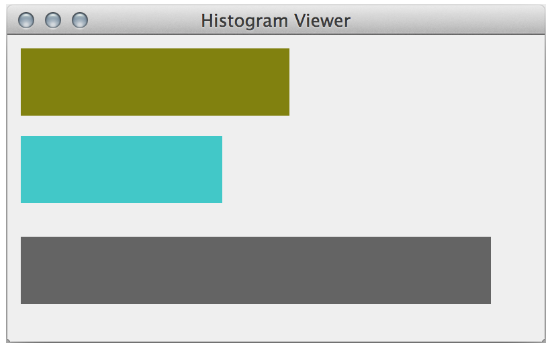
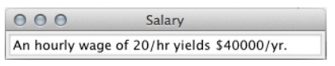
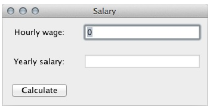

# Week 3 Day 2

## Two-Dimensional Arrays

A **two-dimensional** array is used to contains values across multiple rows and columns. 


**Declaration**:
```java
int[][] ary = new int[3][5];
```
- `int[][]` declares a 2D array of integers.
- `[3]` defines the number of rows.
- `[5]` defines the number of columns

Under the hood, a 2D array is implemented as an array of arrays. For example, `int[][] ary = new int[2][3]` allocates a 2-element array, where each array element is itself a 3-element array.

**Exercise**: Create a table of driving distances.
  |          | Boston | Chicago | Los Angeles |
  |----------|--------|---------|-------------|
  |Boston    |0       | 960     | 2960        |
  |Chicago   |960     | 0       | 2011        |
  |LA        |2960    | 2011    | 0           |

# Chapter 20 GUI (Continued)

## Swing GUI Components


**Adding Components to a GUI**:
1. Create the components using its constructor. Ex: `JButton button = new JButton("Click Me");`
2. Use available methods to customize the component. Ex: `button.setBackground(Color.YELLOW);`
3. Add components to their containers. Ex: `panel.add(button);`

## Layout Managers


- `BoarderLayout`: Assign components to `NORTH`, `SOUTH`, `CENTER`, `EAST`, `WEST`.
- `GridLayout`: Create a grid to contain components. `GridLayout(3, 2)`
- `GridBagLayout`: Most detailed layout manager. (Figure 14.3.1, Table 14.3.1)

## Action Listeners
User input is handled by various action listeners.


1. Choose the appropriate listener based on the event to be monitored.
2. Define a class that implements the listener.
3. Connect the listener with the graphical component by calling the add method (`addActionListener`, `addMouseListener`, ...)


**Exercises**:






