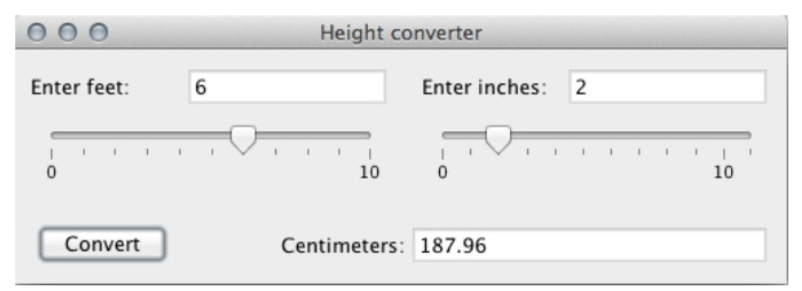

# Review for Final Exam

## Topics Before Midterm
- Classes and objects
- Derived classes
- Abstract classes
- Interfaces
- `toString()` and `equals(Object)` methods
- `compareTo(Object)` method
- Exception handling

## File I/O
- Read from a file: Scanner, FileInputStream
- Write to a file: PrintWriter, FileOutputStream
- Exception handling with file I/O: FileNotFoundException
- String and character manipulation: Useful methods introduced in Sec. 4.13 - 4.16.

**Exercise**: 
1. File Integers.txt contains a group of integers in the following format:

Write a program to find the largest and the smallest integer in the file. Use exception handling properly so that the program does not crash if the file does not exist.

2. Write a program that generates a file August.txt that indicates which day of week it is for each day in August, 2022. The first five row of the file should look like this:

## 2D Arrays & ArrayLists
- 2D arrays: definition, find number of rows/columns, iterate through array
- ArrayLists: definition, frequently-used methods

**Exercise**: 
1. Generate an 8*10 array containing randomly generated integers between 1 and 100. Find the average of all numbers.
2. Generate an array list containing 80 randomly generated integers between 1 and 100. Find the average of all numbers.

## GUI (Graphical User Interface)
- JFrame
- JComponent and paintComponent(Graphics)
- Built-in GUI components
- Layout managers
- Event listeners

**Exercise**: 
1. Create a program Counter.java with the following user interface:

The program initially shows 0 in the textfield. Whenever the user clicks the button, the counter should increment the value.

2. Create a program HeightConverter.java with the following user interface:

When the user enters the number for feet and inches and clicks the “Convert” button, the program should calculate the amount of centimeters and display the result in the lower-right text field (1 feet = 12 inches, 1 inch = 2.54 centimeters).

## Recursion
- Count down
- Fibbonacci numbers
- Binary search (numbers, strings, comparable objects)

**Exercise**:
1. Write a recursive method getFibbonacciNumber(int k) that returns the k-th Fibbonacci number.
2. Given an array `arr` of strings in alphabetical order and a string `targetString`, use binary search to find the index of the first appearance of `targetString` in `arr`. If it doesn’t exist, return -1.
3. Given an array list `arr` of strings in alphabetical order and a string `targetString`, use binary search to find the index of the first appearance of `targetString` in `arr`. If it doesn’t exist, return -1.

